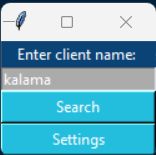
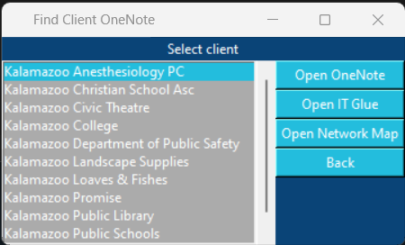
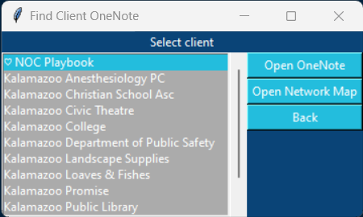
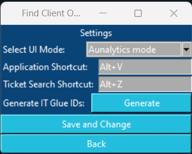
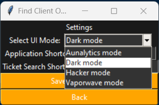
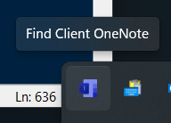

# Find Client OneNote

This application helps you find and open a client's OneNote quickly, among other things.

This project is heavily inspired by Brian Emmons' PowerShell script, which essentially does the same thing. 
It located in the NOC Playbook under "Tools and Shortcuts" -> "PS - Find Customer Folders"

## Table of Contents

- [Features](#features)
- [Installation](#installation)
- [GUI Navigation](#gui-navigation)
  - [Main Menu](#main-menu)
  - [Selection Screen](#selection-screen)
  - [Settings](#settings)
  - [System Tray](#system-tray)
- [Using the AutoTask ticket look-up](#using-the-autotask-ticket-look-up)

## Features

- **Search for Clients**: Tkinter-based GUI for searching and selecting clients based on prtial names or abbreviations.
- **Documentation Access**: Directly open a client's "Network & Wireless" folder or OneNote file through the application
- **Favoriting**: Favorite specific clients for quicker access in future searches.
- **Hotkey Support**: Use hotkeys for quick access to the search bar or AutoTask ticket lookup
- **System Tray Integration**: Use the system tray icon for quick access to settings or quitting the application.
- **Color Schemes**: Customize the GUI color scheme with multiple different layouts
- **Keyboard and UI Navigation**: Navigate through the application using the keyboard or intuitive UI elements.

## Installation

**Installation without compiling**
1. Download the `.zip` file from this project's most recent release and unzip the folder to wherever you want
2. Run the `.exe` and use the default shortcut, `Control+V`, or the system tray icon to bring up the GUI for the first time
3. The `.exe` needs to be located within the 'Find Client OneNote' to function properly, so create a shortcut of it if you want to launch it from outside the folder

**Installation with compiling**
1. Download this project's resources
2. Install Python from here: https://www.python.org/downloads/
3. Open a command prompt, `cd` to the project resources folder main folder, and run the command `python -m pip install requirements.txt`
4. Run the "compile_command.bat" file by double clicking it
5. The compiled project will be located within "dist\Find Client OneNote"
  

## GUI Navigation

### Main Menu

#### UI Elements for Main Menu
- **Search Bar**: Type in your search query to look for clients.
- **Search Button**: Initiates a search for clients based on the query in the search bar.
- **Settings Button**: Opens the settings.

#### Keyboard Shortcuts for Main Menu
- **Enter**: Initiates a search for clients based on the query in the search bar.
- **Escape**: Opens the settings.

---

### Selection Screen

#### UI Elements for Selection Screen
- **Client List**: Displays a scrollable list of all clients.
- **Open OneNote Button**: Opens the OneNote of the currently highlighted client.
- **Open Network & Wireless Button**: Opens the Network & Wireless folder of the currently highlighted client.
- **Back Button**: Opens the main menu.

#### Keyboard Shortcuts for Selection Screen
- **Enter**: Opens the OneNote of the currently highlighted client.
- **Control+Enter**: Opens the Network & Wireless folder of the currently highlighted client.
- **Up/Down Arrows, Scroll Wheel**: Navigates through the list of clients.
- **Tab, Right Click**: Toggles between favoriting and unfavoriting the currently highlighted client.
- **Escape**: Opens the main menu.

---

### Settings

#### UI Elements for Settings
- **UI Mode Dropdown**: Allows you to switch between different color schemes and layouts.
- **Application Shortcut Toggle**: Lets you define a custom keyboard shortcut for opening the GUI.
- **Ticket Search Shortcut Input**: Lets you define a custom keyboard shortcut for ticket searching.

#### Keyboard Shortcuts for Settings
- **Escape**: Opens the main menu.

---

### System Tray

- **Right-Click Icon**: Use the menu to open GUI settings or quit the application entirely.

---

## Using the AutoTask ticket look-up
1. Run the `.exe` file.
2. Highlight text and press the default shortcut, `Ctrl+Z`.
3. The application will open a web browser and search in AutoTask for tickets that contain the highlighted text in their title or description.

---

### Please shoot me a message if you have any issues or bugs and I will work quickly to get them fixed! Also, make sure to check out the GitHub issues sections because I may post temporary fixes / workarounds there before a push a full fix!![image]
